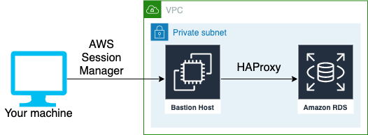

[](https://actions-badge.atrox.dev/moia-oss/bastion-host-forward/goto)
[](https://badge.fury.io/js/%40moia-oss%2Fbastion-host-forward)
[](https://badge.fury.io/py/moia-dev.bastion-host-forward)

# Bastion Host Forward

This is a CDK Library providing custom bastion host constructs for connecting to
several AWS data services. When building secure infrastructure, we face the
problem that the data layer is only accessible from inside the VPC. These
Bastion Hosts close the gap and let you interact with the data layer as they
would be hosted on your machine.

Currently the following AWS Services are supported:

| AWS Service       | CDK Construct                        |
| ----------------- | ------------------------------------ |
| Aurora Serverless | `BastionHostAuroraServerlessForward` |
| Redis             | `BastionHostRedisForward`            |
| Redshift          | `BastionHostRedshiftForward`         |
| RDS               | `BastionHostRDSForward`              |

# V1 DISCLAIMER

We introduced v1.0.0 recently, which now relies on v2 of CDK. This introced an
incompability, because they don't offer a L2 Construct for
[Redshift](https://docs.aws.amazon.com/cdk/api/v2/docs/aws-cdk-lib.aws_redshift-readme.html)
anymore. This is why we cant offer the `BastionHostRedshiftForward` Construct
anymore. We would need to accept a CFN L1 Construct instead, but we didn't allow
this for the `BastionHostRedisForward` as well. Instead we decided to rename the
`BastionHostRedisForward` to `GenericBastionHostForward`, which needs only the
endpoint address and the port of the data store to be able to forward connections.

With the new `GenericBastionHostForward` you are still able to forward
connections to Redis and Redshift and also every other data store in AWS, which
we don't support specifically so far.

# Technical details

The bastion hosts are extensions of the official `BastionHostLinux` CDK
construct, which allows connecting to the bastion host and from there connect to
the data layer.

These constructs additionally install and configure
[HAProxy](https://www.haproxy.org/) to forward the endpoint of the chosen data
store. They also have the SSM Agent to the bastion host, so you can connect via
the AWS Session Manager. Connecting to a bastion host via the AWS Session
Manager brings a couple of benefits:

- No management of SSH Keys anymore
- AWS IAM defines who is able to connect to the bastion host
- Bastion Hosts don't need to be hosted in public subnets anymore
- Easy port forwarding with a single command

The combination of having a local port forward via SSM Session Manager and the
HAProxy on the bastion host itself let you interact with the data layer as they
would be on your machine. This means you can connect to them via localhost:<port
of the data service> and also use visual tools like DataGrip or MySQL Workbench
to interact with the data store in AWS. The following graphic illustrates the
described procedure on the example of RDS:



# Setup

First of all you need to include this library into your project for the language
you want to deploy the bastion host with

## Javascript/Typescript

For Javascript/Typescript the library can be installed via npm:

```
npm install @moia-oss/bastion-host-forward
```

## Python

For python the library can be installed via pip:

```
pip install moia-dev.bastion-host-forward
```

# Examples

The following section includes some examples in supported languages how the
Bastion Host can be created for different databases.

## Bastion Host for RDS in Typescript

A minimal example for creating the RDS Forward Construct, which will be used via
username/password could look like this snippet:

```typescript
import * as cdk from '@aws-cdk/core';
import { SecurityGroup, Vpc } from '@aws-cdk/aws-ec2';
import { DatabaseInstance } from '@aws-cdk/aws-rds';
import { BastionHostRDSForward } from '@moia-oss/bastion-host-forward';

export class BastionHostPocStack extends cdk.Stack {
  constructor(scope: cdk.App, id: string, props?: cdk.StackProps) {
    super(scope, id, props);

    const vpc = Vpc.fromLookup(this, 'MyVpc', {
      vpcId: 'vpc-0123456789abcd'
    });

    const securityGroup = SecurityGroup.fromSecurityGroupId(
      this,
      'RDSSecurityGroup',
      'odsufa5addasdj',
      { mutable: false }
    );

    const rdsInstance = DatabaseInstance.fromDatabaseInstanceAttributes(
      this,
      'MyDb',
      {
        instanceIdentifier: 'abcd1234geh',
        instanceEndpointAddress: 'abcd1234geh.ughia8asd.eu-central-1.rds.amazonaws.com',
        port: 5432,
        securityGroups: [securityGroup]
      }
    );

    new BastionHostRDSForward(this, 'BastionHost', {
      vpc: vpc,
      rdsInstance: rdsInstance,
      name: 'MyBastionHost',
    });
```

If the RDS is IAM Authenticated you also need to add an `iam_user` and
`rdsResourceIdentifier` to the BastionHostRDSForward:

```typescript
...
new BastionHostRDSForward(this, 'BastionHost', {
  vpc: vpc,
  rdsInstance: rdsInstance,
  name: 'MyBastionHost',
  iamUser: 'iamusername',
  rdsResourceIdentifier: 'db-ABCDEFGHIJKL123'
});
```

This will spawn a Bastion Host in the defined VPC. You also need to make sure
that IPs from within the VPC are able to connect to the RDS Database. This
needs to be set in the RDS's Security Group. Otherwise the Bastion Host can't
connect to the RDS.

## Bastion Host for a generic data store on AWS (Redis, Redshift etc.)

### Typescript

A minimal example for creating the Generic Forward Construct, which will be used
via username/password could look like this snippet. In this case we forward a
connection to a RedShift instance, but this can also be a Redis Node or any
other data store on AWS. Instead of passing the complete L2 construct and
letting the library extract the necessary properties, the client is passing them
directly to the construct:

```typescript
import * as cdk from '@aws-cdk/core';
import { GenericBastionHostForward } from '@moia-dev/bastion-host-forward';
import { SecurityGroup, Vpc } from '@aws-cdk/aws-ec2';
import { Cluster } from '@aws-cdk/aws-redshift';

export class PocRedshiftStack extends cdk.Stack {
  constructor(scope: cdk.Construct, id: string, props?: cdk.StackProps) {
    super(scope, id, props);

    const vpc = Vpc.fromLookup(this, 'MyVpc', {
      vpcId: 'vpc-12345678',
    });

    const securityGroup = SecurityGroup.fromSecurityGroupId(this, 'BastionHostSecurityGroup', 'sg-1245678', {
      mutable: false,
    });

    const redshiftCluster = Cluster.fromClusterAttributes(this, 'RedshiftCluster', {
      clusterName: 'myRedshiftClusterName',
      clusterEndpointAddress: 'myRedshiftClusterName.abcdefg.eu-central-1.redshift.amazonaws.com',
      clusterEndpointPort: 5439,
    });

    new GenericBastionHostForward(this, 'BastionHostRedshiftForward', {
      vpc,
      securityGroup,
      name: 'MyRedshiftBastionHost',
      address: redshiftCluster.clusterEndpointAddress,
      port: redshiftCluster.clusterEndpointPort,
    });
  }
}
```

### Python

```python
from aws_cdk import core as cdk
from aws_cdk import aws_redshift
from aws_cdk import aws_ec2
from moia_dev import bastion_host_forward


class PocRedshiftStack(cdk.Stack):

    def __init__(self, scope: cdk.Construct, construct_id: str, **kwargs) -> None:
        super().__init__(scope, construct_id, **kwargs)
        vpc = aws_ec2.Vpc.from_lookup(
            self,
            "vpc",
            vpc_id="vpc-12345678"
        )
        security_group = aws_ec2.SecurityGroup.from_security_group_id(
            self,
            "sec_group", "sg-12345678"
        )
        redshift_cluster = aws_redshift.Cluster.from_cluster_attributes(
            self,
            "cluster",
            cluster_name="myRedshiftClusterName",
            cluster_endpoint_address="myRedshiftClusterName.abcdefg.eu-central-1.redshift.amazonaws.com",
            cluster_endpoint_port=5439
        )

        bastion_host_forward.GenericBastionHostForward(
            self,
            "bastion-host",
            name="my-bastion-host",
            security_group=security_group,
            address: redshift_cluster.cluster_endpoint_address,
            port: redshift_cluster.cluster_endpoint_port,
            vpc=vpc
        )
```

## Bastion Host for Aurora Serverless

```typescript
import * as cdk from '@aws-cdk/core';
import { SecurityGroup, Vpc } from '@aws-cdk/aws-ec2';
import { ServerlessCluster } from '@aws-cdk/aws-rds';
import { BastionHostAuroraServerlessForward } from '@moia-dev/bastion-host-rds-forward';

export class BastionHostPocStack extends cdk.Stack {
  constructor(scope: cdk.App, id: string, props?: cdk.StackProps) {
    super(scope, id, props);

    const vpc = Vpc.fromLookup(this, 'MyVpc', {
      vpcId: 'vpc-0123456789abcd'
    });

    const securityGroup = SecurityGroup.fromSecurityGroupId(
      this,
      'AuroraSecurityGroup',
      'odsufa5addasdj',
      { mutable: false }
    );

    const serverlessCluster = ServerlessCluster.fromServerlessClusterAttributes(
      this,
      'Aurora',
      {
        clusterIdentifier: 'my-cluster',
        port: 3306,
        clusterEndpointAddress: 'my-aurora.cluster-abcdef.eu-central-1.rds.amazonaws.com',
        securityGroups: [securityGroup]
      }
    );

    new BastionHostAuroraServerlessForward(this, 'BastionHost', {
      vpc,
      serverlessCluster,
    });
```

## Deploying the Bastion Host

When you setup the Bastion Host for the Database you want to connect to, you can
now go forward to actually deploy the Bastion Host:

```
cdk deploy
```

When the EC2 Instance for you Bastion Host is visible you can continue with the
setup of the Session-Manager Plugin on your Machine

# Install the Session-Manager Plugin for AWS-CLI

You are also able to connect to the Bastion Host via the AWS Web
Console. For this go to `AWS Systems Manager` -> `Session Manager` -> choose
the newly created instance -> click on start session.

But overall it's a much more comfortable experience to connect to the Bastion
Session Manager Plugin. On Mac OSX you can get it via homebrew for example:

```
brew install --cask session-manager-plugin
```

For Linux it should also be available in the respective package manager. Also
have a look at [the official installation instructions from
AWS](https://docs.aws.amazon.com/systems-manager/latest/userguide/session-manager-working-with-install-plugin.html)

## Forward the connection to your machine

The Session Manager offers a command to forward a specific port. On the Bastion
Host a HAProxy was installed which forwards the connection on the same
port as the specified service. Those are by default:

- RDS MySQL: 3306
- RDS PostgreSQL: 5432
- Redis: 6739
- Redshift: 5439

In the following example, we show how to forward the connection of a PostgreSQL
database. To forward the connection to our machine we execute the following
command in the shell:

```
aws ssm start-session \
    --target <bastion-host-id> \
    --document-name AWS-StartPortForwardingSession \
    --parameters '{"portNumber": ["5432"], "localPortNumber":["5432"]}'
```

This creates a port forward session on the defined `localPortNumber`. The
target is the id of the bastion host instance. This will be output
automatically after deploying the bastion host. The `portNumber` must be the
same as the RDS Port.

Now you would be able to connect to the RDS as it would run on localhost:5432.

_Note_

In the example of a MySQL running in Serverless Aurora, we couldn't connect to
the database using localhost. If you face the same issue, make sure to also try to connect via
the local IP 127.0.0.1.

Example with the MySQL CLI:

```sh
mysql -u <username> -h 127.0.0.1 -p
```

## Additional step if you are using IAM Authentication on RDS

If you have an IAM authenticated RDS, the inline policy of the bastion
host will be equipped with access rights accordingly. Namely it will get `rds:*`
permissions on the RDS you provided and it also allows `rds-db:connect` with
the provided `iamUser`.

Most of the steps you would perform to connect to the RDS are the same, since it wouldn't
be in a VPC.

First you generate the PGPASSWORD on your local machine:

```
export
PGPASSWORD="$(aws rds generate-db-auth-token
--hostname=<rds endpoint> --port=5432
--username=<iam user> --region <the region of the rds>)"
```

You also need to have the RDS certificate from AWS, which you can download:

```
wget https://s3.amazonaws.com/rds-downloads/rds-ca-2019-root.pem
```

There is now an additional step needed, because the certificate checks against
the real endpoint name during the connect procedure. Therefore we need to add
an entry to the `/etc/hosts` file on our machine:

```
echo "127.0.0.1  <rds endpoint>" >> /etc/hosts
```

Now you can connect to the IAM authenticated RDS like this:

```
psql "host=<rds endpoint> port=5432 dbname=<database name> user=<iamUser> sslrootcert=<full path to downloaded cert> sslmode=verify-ca"
```

For a full guide on how to connect to an IAM authenticated RDS check out [this
guide by AWS](https://aws.amazon.com/premiumsupport/knowledge-center/users-connect-rds-iam/)
